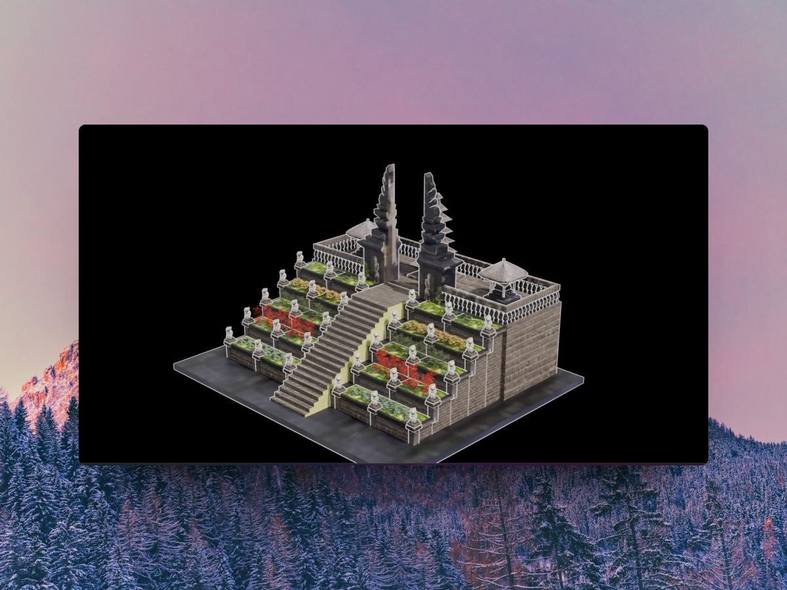
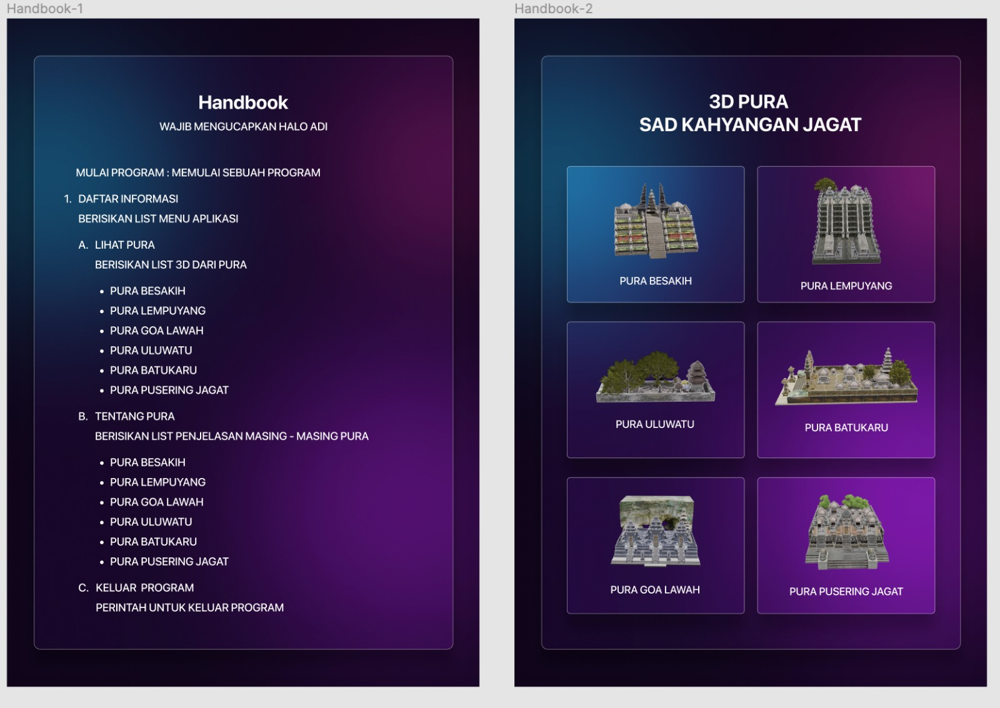

# Teknologi Imersif Hologram

  <picture>
    <source media="(prefers-color-scheme: dark)" srcset="./public/thumbnail-main.png">
    
  </picture>

The website I created for my Immersive Technology class is built using Next.js 13 and incorporates speech recognition, allowing users to control video playback through voice commands.

## Features

- New `/app` dir,
- Next.js 13
- Convert Voice to Text in Bahasa Using **react-speech-recognition**
- Styled using **Tailwind CSS**
- Written in **TypeScript**

## Demo

  <picture>
    <source media="(prefers-color-scheme: dark)" srcset="./public/thumbnail-gif.gif">
    
  </picture>

## Commands

  <picture>
    <source media="(prefers-color-scheme: dark)" srcset="./public/thumbnail-commands.jpg">
    
  </picture>

## Important!

- This project is designed to function according to the commands listed above.
- It is recommended to run the application locally to avoid video stuttering.
- Use fullscreen mode for the best experience.
